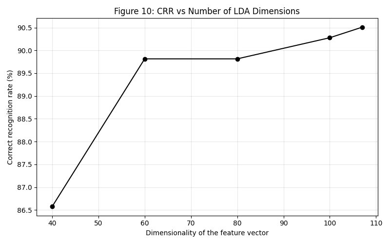
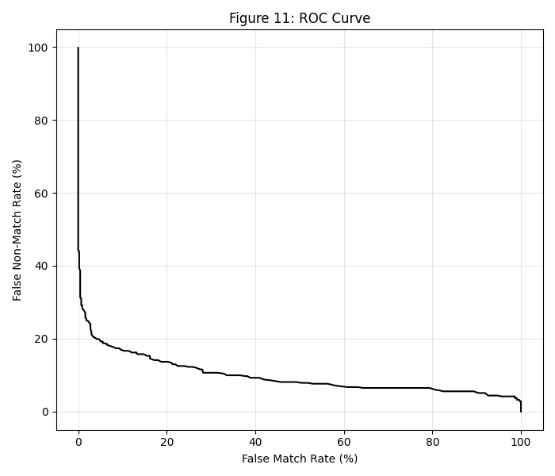

# Iris Recognition Project

This repository contains the implementation of an automated iris recognition system based on the methodology described in the 2003 paper [*Personal Identification Based on Iris Texture Analysis*](https://ieeexplore.ieee.org/document/1251145) by Li Ma et al. The project focuses exclusively on the core biometric pipeline: Image Preprocessing, Feature Extraction, and Iris Matching.

## Project Structure
```text
├── src/                    # Source code
│   ├── IrisRecognition.py      # Main entry point
│   ├── IrisLocalization.py     # Pupil & iris boundary detection
│   ├── IrisNormalization.py    # Cartesian → polar mapping
│   ├── ImageEnhancement.py     # Normalized image enhancement
│   ├── FeatureExtraction.py    # Filtering & feature extraction
│   ├── IrisMatching.py         # Fisher LDA + nearest center classifier
│   └── PerformanceEvaluation.py # CRR & ROC evaluation
├── data/                   # CASIA Iris Image Database (version 1.0)
├── figures/                # Output figures (ROC curves, tables)
└── README.md
```

## Setup and Execution

To run the full recognition pipeline on the CASIA Iris Image Database (version 1.0):

```bash
# 1. Ensure the dataset is placed correctly
# Expected path: data/CASIA Iris Image Database (version 1)/

# 2. Setup the environment
python3 -m venv .venv
source .venv/bin/activate
pip install -r requirements.txt

# 3. Execute the main orchestration script
python src/IrisRecognition.py
```

## Logic of the Design

Our system processes raw eye images step by step to identify people based on their iris textures. 

We start with **Iris Localization**. First, we estimate the rough center of the pupil using 1D projections of the image intensities. Then we crop a small window around it and use thresholding and image moments to find the exact pupil center. To find the outer iris boundary, we use Canny edge detection and a radial ray-casting technique. This ray-casting is faster than the standard Hough transform and filters out noise like eyelashes. 

After finding the boundaries, we move to **Normalization**. Since the iris size changes based on camera distance and pupil dilation, we "unwrap" the ring counterclockwise into a fixed 64x512 rectangular block. This mapping from Cartesian $(x,y)$ to pseudo-polar coordinates gives us scale and translation invariance, following the linear interpolation:

$$x = x_p(\theta) + [x_i(\theta) - x_p(\theta)] \cdot \frac{Y}{M}$$
$$y = y_p(\theta) + [y_i(\theta) - y_p(\theta)] \cdot \frac{Y}{M}$$

Because the unwrapped images often have bad contrast and uneven lighting (like reflections), we apply **Image Enhancement**. We estimate the background illumination using the mean of 16x16 blocks, resize it with bicubic interpolation, and subtract it from the image. Then we use histogram equalization on 32x32 regions to make the texture clearer.

Next is **Feature Extraction**. We only use the top 48x512 Region of Interest (ROI) of the image to avoid the bottom eyelid. We filter this ROI using a custom spatial filter across two frequency channels ($f=0.1$ and $f=0.2$). Unlike normal Gabor filters, this one uses a circularly symmetric function to capture texture spreading along the radial direction. 

$$G(x,y,f) = \frac{1}{2\pi \sigma_x \sigma_y} \exp \left( -0.5 \left( \frac{x^2}{\sigma_x^2} + \frac{y^2}{\sigma_y^2} \right) \right) \cdot \cos \left( 2\pi f \sqrt{x^2 + y^2} \right)$$

We split the filtered images into 8x8 blocks and calculate the Mean and Average Absolute Deviation (AAD or $\sigma$) for each block. This gives us a final feature vector of 1,536 values.

Finally, in the **Matching** phase, we use Fisher Linear Discriminant (LDA) to reduce the high-dimensional vectors. A nearest-center classifier is then used to compute distances (L1, L2, and Cosine) between the test vector and the training classes to find the closest match. To normalize the similarity scale, we rely on the Cosine Distance measure:

$$d_3(f, f_i) = 1 - \frac{f^T f_i}{||f|| \cdot ||f_i||}$$

## Experimental Results

Our code successfully passes the >=80% Correct Recognition Rate (CRR) requirement for all similarity measures. Below are the tables and figures showing our output (matching Table 3/Fig 10 and Table 4/Fig 11 from the Ma paper).

### Identification Mode (CRR)

**Table 3: Correct Recognition Rate (%) by Similarity Measure**

| Similarity Measure | Original Features | Reduced Features |
| :--- | :--- | :--- |
| L1 distance | 92.36 | 88.89 |
| L2 distance | 89.81 | 89.81 |
| Cosine similarity | 91.44 | 92.82 |


*Figure 10 counterpart: Visualization of the CRR across different dimensionality thresholds.*

### Verification Mode (ROC Curve)

**Table 4: FMR and FNMR at Threshold Values**

| Threshold | FMR (%) | FNMR (%) |
| :--- | :--- | :--- |
| 0.446 | 0.2315 | 33.5648 |
| 0.472 | 0.2315 | 28.4722 |
| 0.502 | 0.2315 | 23.3796 |


*Figure 11 counterpart: The Receiver Operating Characteristic (ROC) curve demonstrating the trade-off between False Match Rate and False Non-Match Rate.*

## Limitations of the Current Design

Even if it works well on the CASIA V1 dataset, our design has some limits:

First, it assumes that the pupil and iris are perfect circles. In real life, pupils can be elliptical and not perfectly centered. Also, to save time and compute power, we used radial ray-casting instead of the Hough Transform suggested in the paper. It's faster but it might fail on really bad quality images.

Second, the pipeline doesn't handle occlusions well and lacks rotation invariance. We unwrap the iris but we don't actively mask out thick eyelashes or eyelids. If eyelashes cover the top part of the iris, their texture becomes part of the feature vector, causing noise and increasing the FNMR. Also, to keep the execution time low, we only match the unwrapped image at 0 degrees. The original paper creates multiple templates at different angles (like -9 to +9 degrees) to handle head tilts, but we skipped this step.

Lastly, the system tries to process every image. If an image is super blurry or out of focus, the spatial filters will extract flat statistics, which lowers the overall accuracy.

## How to Improve It

To make this system better and more robust, we could implement a few changes:

The biggest improvement would be adding an active masking step for occlusions right after localization. We could use parabolic Hough transforms to find eyelids and variance to find eyelashes, creating a binary mask. This would tell the feature extractor to ignore bad pixels, which would lower the FNMR.

We could also replace the simple circular edge detection with something like Active Contour Models (Snakes) or Daugman's Integro-differential operators. These handle non-circular and off-center pupils much better. Adding back the multiple-angle templates during the matching phase would also fix the rotation issue.

Finally, adding an Image Quality Assessment (IQA) module like the paper suggests would save a lot of time. By looking at the 2D Fourier spectrum of the image with a simple classifier, the system could just throw away blurry images before wasting time doing the heavy spatial filtering.